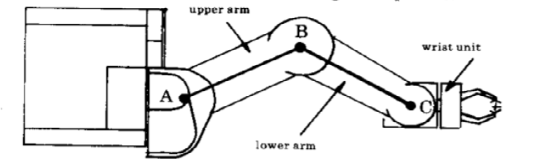

# umi-rtx

This repository contains the code to control the UMI-RTX robot. The UMI-RTX robot was designed in 1985 for Universal Machine Intelligence Ltd [1] and first released in 1986 [2-3].  It is a robot in SCARA format with extended vertical travel. This robot is designed to work in a cylindrical workspace. With its three axis wrist the UMI-RTX robot has in total 6 degrees of freedom.

The upper arm and lower arm have the same length: AB == BC.  This means that you can move the wrist in a straight line outwards from the column - a radial line between the shoulder and wrist spindles - by rotating the two parts of the arm, making sure that angle P is always half angle Q:
The gear ratio from the shoulder motor to the upper arm is twice that of the elbow motor to the lower arm. To move the wrist in a radial line, both motors are driven at the same speed but in opposite directions. The benefit of this arrangement is that the robot controller can keep track of the position of the wrist in cylindrical coordinates very easily, by simple calculations based on the motor encoder counts.

<figure>

</figure>

In addition, the gripper is automatically pointing along the radial line:
This is achieved without needing to drive the yaw motor (angle R): the yaw is not only coupled to its own motor, but also coupled to the elbow motor!

At the University of Amsterdam, the UMI-RTX robot was used to play chess [4], which it still can do (with code ported to Ubuntu 20.04).

[1] Tim Jones, <a href=http://davidbuckley.net/RS/History/LondonRobotics85/TimJonesUMI.htm>Developing a Personal Robot from Concept to Final Product</a>, Personal Robotics Seminar, London, UK, 3rd July 1985.

[2] Universal Machine Intelligence Ltd, <a href=https://wiki.london.hackspace.org.uk/w/images/3/3c/RTX_Inside.pdf>Inside RTX</a>, guide to the design, mechanics and electronics, April 1987.

[3] Universal Machine Intelligence Ltd, <a href=https://staff.fnwi.uva.nl/a.visser/education/ZSB/MaintenanceManualForRTX.pdf>Maintenance Manual for RTX </a>, August 1987.

[4] Groen, F., der Boer, G., van Inge, A., and Stam, R. (1992). <a href=https://ieeexplore.ieee.org/abstract/document/245137>A chess playing robot: lab course in robot sensor integration</a>. In Instrumentation and Measurement Technology Conference, 1992.  IMTC ’92., 9th IEEE, pages 261–26
